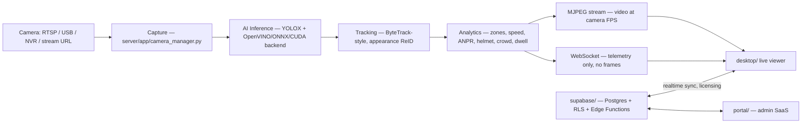

# CamAI

**CamAI** is an edge-first AI video analytics platform for multi-camera CCTV deployments. It ingests RTSP/USB/NVR/YouTube-style streams, runs on-device object detection and tracking, and layers traffic and security analytics (speed estimation, ANPR, helmet detection, zone/line rules, crowd and dwell metrics) on top — with **no frame ever leaving the machine** by default.

The product is four workspaces sharing one repository:

| Workspace | What it is | Stack |
|---|---|---|
| [`server/`](server/) | Local AI engine — capture, inference, tracking, analytics, recording | FastAPI, OpenCV, ONNX Runtime / OpenVINO |
| [`desktop/`](desktop/) | Windows monitoring client (multi-grid live view, licensing, engine supervisor) | Electron + React + TypeScript |
| [`portal/`](portal/) | Cloud SaaS admin portal (orgs, users, licenses, cameras, alerts, billing) | React + Vite + Tailwind + Supabase JS |
| [`supabase/`](supabase/) | Multi-tenant backend — Postgres schema, RLS policies, Edge Functions | Supabase (Postgres, Auth, Realtime, Edge Functions) |

There is no separate `client/` workspace — the live CCTV viewer lives inside `desktop/`, and the portal is a management/admin surface, not a video viewer.

## Documentation

Full documentation lives in [`docs/`](docs/README.md):

| Doc | Covers |
|---|---|
| [Architecture](docs/ARCHITECTURE.md) | How the four workspaces fit together, data flow, multi-tenancy model |
| [AI Engine](docs/AI_ENGINE.md) | Detection/tracking/analytics pipeline, models, hardware backends, tiling |
| [API Reference](docs/API.md) | REST endpoints and WebSocket telemetry protocol exposed by `server/` |
| [Database](docs/DATABASE.md) | Supabase schema, RLS, licensing/device-binding model |
| [Installation](docs/INSTALLATION.md) | Dev environment setup for all four workspaces |
| [Deployment](docs/DEPLOYMENT.md) | Building the engine/installer, releasing, deploying Supabase and the portal |
| [Security](docs/SECURITY.md) | Auth, RBAC, encryption, and current audit status |
| [Performance](docs/PERFORMANCE.md) | Measured throughput/latency and how to reproduce the numbers |
| [Licensing](docs/LICENSING.md) | Ownership and third-party (model + dependency) license inventory |
| [Testing](docs/TESTING.md) | Test suite layout and how to run it |
| [User Guide](docs/USER_GUIDE.md) | Operator-facing walkthrough of the desktop app |
| [Handover](docs/HANDOVER.md) | What a buyer/new engineer receives and known open items |

## Quick start (development)

Prerequisites: Python 3.11+, Node.js 18+, FFmpeg on `PATH`. See [`docs/INSTALLATION.md`](docs/INSTALLATION.md) for full detail, hardware backend notes, and per-workspace environment variables.

```bash
# AI engine
cd server
python -m venv .venv && .venv\Scripts\activate
pip install -r server-requirements.txt
python run_engine.py            # http://127.0.0.1:8000 (docs at /docs)

# Desktop client (separate shell)
cd desktop
npm install
npm run dev

# Cloud portal (separate shell)
cd portal
npm install
npm run dev                     # http://localhost:5174
```

## Architecture at a glance



Video and AI are deliberately decoupled: the desktop renders MJPEG at the camera's native FPS and overlays bounding boxes from a separate WebSocket telemetry feed, so a slow AI pass degrades overlay freshness, never the live picture. See [`docs/ARCHITECTURE.md`](docs/ARCHITECTURE.md).

## License

Proprietary — see [`LICENSE.md`](LICENSE.md) and [`docs/LICENSING.md`](docs/LICENSING.md) for the third-party component inventory.
