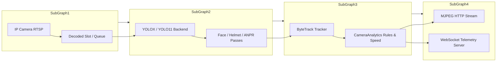

# CamAI Enterprise - AI Vision & Video Analytics Platform

[](LICENSE)
[](server/)
[](client/)
[](desktop/)
[](server/tests)

**CamAI Enterprise** is a complete, production-ready, edge-first AI Vision and Video Analytics System designed for high-density multi-camera deployment. It processes live RTSP/MJPEG IP camera streams, executes multi-model AI inference (detection, tracking, ANPR, helmet detection, face recognition, speed estimation), and delivers real-time telemetry over WebSockets in under 50ms.

---

## Key Features

- **GPU First AI Engine**: Native acceleration via **NVIDIA TensorRT (FP16)**, **CUDA FP16**, **Intel OpenVINO GPU**, **Windows DirectML (DirectX 12)**, and CPU fallback.
- **High-FPS Interleaved Tracking**: Blends YOLOX/YOLO11 deep object detection with ByteTrack Kalman filter predictions to achieve 25–60 FPS per stream.
- **Adaptive GPU Tile Governor**: Dynamically scales inference resolution (320px–1280px) and tile allocations to maintain GPU utilization between 70% and 90%.
- **Comprehensive Analytics Suite**:
  - Vehicle speed estimation (km/h) with noise-filtered 1D Kalman tracking.
  - Automatic Number Plate Recognition (ANPR) & OCR.
  - Worker helmet and PPE compliance monitoring.
  - Facial recognition and perimeter intrusion alerts.
  - Unattended object / abandoned luggage detection.
  - Heatmap generation, directional line crossing, and zone entry/exit counters.
- **Enterprise Application Suite**:
  - **Desktop Application** (Electron + React): Multi-grid monitor, fullscreen viewer, low-latency overlay, system resource gauges.
  - **SaaS Web Portal** (React + Tailwind + Supabase/PostgreSQL): Multi-tenant management, zone editor, incident logs, historical reporting.
  - **FastAPI Core Engine**: Async REST API, WebSocket telemetry server, automated incident clip recorder.

---

## Documentation Package Index

Complete enterprise technical documentation is located in the [`docs/`](docs/) directory:

| Document | Description |
| :--- | :--- |
| [`01_EXECUTIVE_SUMMARY.md`](docs/01_EXECUTIVE_SUMMARY.md) | Business problem, ROI, capabilities, and target industry value |
| [`02_PRODUCT_DOCUMENTATION.md`](docs/02_PRODUCT_DOCUMENTATION.md) | System workflows, dashboard, camera management, and rule engines |
| [`03_SOFTWARE_ARCHITECTURE.md`](docs/03_SOFTWARE_ARCHITECTURE.md) | System topology, sequence diagrams, component data flows, and thread design |
| [`04_SOURCE_CODE_DOCUMENTATION.md`](docs/04_SOURCE_CODE_DOCUMENTATION.md) | In-depth module, service, class, and method breakdown |
| [`05_AI_ENGINE_DOCUMENTATION.md`](docs/05_AI_ENGINE_DOCUMENTATION.md) | Model pipelines, hardware backends, tiling, and performance tuning |
| [`06_REST_WEBSOCKET_API.md`](docs/06_REST_WEBSOCKET_API.md) | Full OpenAPI endpoints, WebSocket protocol spec, schemas, and codes |
| [`07_DATABASE_DOCUMENTATION.md`](docs/07_DATABASE_DOCUMENTATION.md) | ER diagrams, Supabase PostgreSQL tables, indexes, RLS policies |
| [`08_INSTALLATION_GUIDE.md`](docs/08_INSTALLATION_GUIDE.md) | Step-by-step setup for Windows, Linux, Docker, CUDA, and dependencies |
| [`09_ADMINISTRATOR_GUIDE.md`](docs/09_ADMINISTRATOR_GUIDE.md) | User management, license activation, backup/restore, and health monitoring |
| [`10_DEVOPS_DEPLOYMENT.md`](docs/10_DEVOPS_DEPLOYMENT.md) | Docker Compose, NGINX reverse proxy, SSL, CI/CD, and scaling |
| [`11_SECURITY_COMPLIANCE.md`](docs/11_SECURITY_COMPLIANCE.md) | JWT auth, RBAC, encryption, OWASP hardening, and audit logging |
| [`12_PERFORMANCE_BENCHMARKS.md`](docs/12_PERFORMANCE_BENCHMARKS.md) | Stress test results, FPS/latency matrices across hardware configurations |
| [`13_TESTING_TROUBLESHOOTING.md`](docs/13_TESTING_TROUBLESHOOTING.md) | Unit test suite execution, failure diagnosis, and troubleshooting matrix |
| [`14_BUYER_HANDOVER_LICENSING.md`](docs/14_BUYER_HANDOVER_LICENSING.md) | Asset handover checklist, source code transfer, and license agreement |

---

## Quick Start (Development)

### Prerequisites
- **Python**: 3.11+
- **Node.js**: 18+ / 20+
- **FFmpeg**: Installed and on `PATH`
- **GPU (Optional)**: NVIDIA GPU with CUDA 11.8/12.x or Intel iGPU with OpenVINO drivers

### 1. Server Setup
```bash
cd server
python -m venv venv
venv\Scripts\activate      # On Windows
# source venv/bin/activate # On Linux
pip install -r requirements.txt
python -m app.main
```
The server will start at `http://127.0.0.1:8000` (API Docs at `http://127.0.0.1:8000/docs`).

### 2. Desktop Monitor Suite Setup
```bash
cd desktop
npm install
npm run dev
```

### 3. Web SaaS Portal Setup
```bash
cd client
npm install
npm run dev
```

---

## Test Verification
Run the backend automated test suite (211+ tests):
```bash
cd server
pytest
```

---

## System Architecture Overview



---

## Support & Handover Contact
For technical due diligence inquiries or enterprise licensing support, refer to [`docs/14_BUYER_HANDOVER_LICENSING.md`](docs/14_BUYER_HANDOVER_LICENSING.md).
