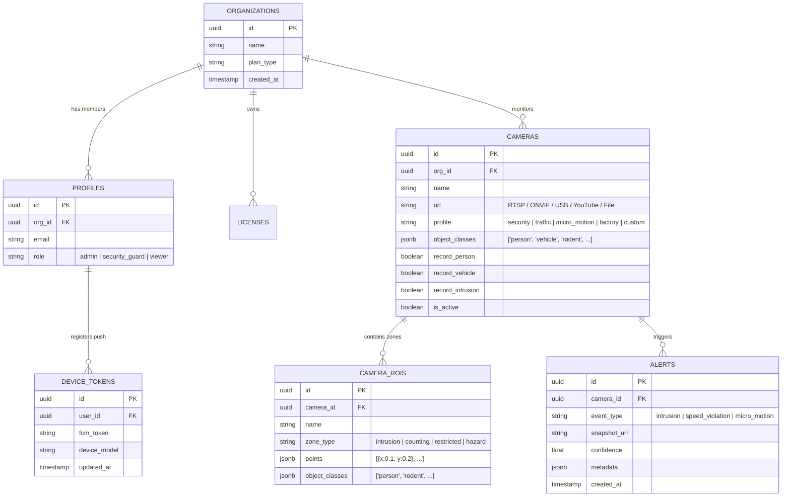

# CamAI Enterprise AI Desktop Ecosystem

**CamAI** is an edge-first, high-performance AI video analytics platform built for enterprise multi-camera CCTV monitoring. The system combines local AI acceleration (OpenVINO, ONNX Runtime, CUDA) with an Electron-based desktop studio, zero-latency streaming, and multi-tenant cloud telemetry synchronization.

---

## 🏗️ System Architecture & Workspace Mapping

The repository consists of modular, interconnected components:

```
                  ┌─────────────────────────────────────────┐
                  │          CCTV Input Feeds               │
                  │  (RTSP, ONVIF, USB, YouTube, Screen)    │
                  └────────────────────┬────────────────────┘
                                       │
                                       ▼
                  ┌─────────────────────────────────────────┐
                  │       Local AI Engine (server/)         │
                  │ - Multi-Threaded Capture & Decoding     │
                  │ - Asynchronous YOLO/ByteTrack Pipeline  │
                  │ - Zero-DCE Night Vision Enhancement     │
                  │ - Tiling Governor & Adaptive Zoom       │
                  └────────────┬───────────────┬────────────┘
                               │               │
            30-40 FPS MJPEG    │               │ WS Telemetry & Alerts
            Stream & Preview   │               │ Bounding Boxes & HUD
                               ▼               ▼
                  ┌─────────────────────────────────────────┐
                  │     Desktop Client Studio (desktop/)    │
                  │ - Electron + React + Tailwind Canvas    │
                  │ - Interactive Multi-Grid Viewer         │
                  │ - Granular Polygon ROI Zone Editor      │
                  │ - Hardware License & Security Enforcer  │
                  └────────────┬───────────────┬────────────┘
                               │               │
                     License   │               │ Event Alerts
                     Verification              │ Sync & Stats
                               ▼               ▼
                  ┌─────────────────────────────────────────┐
                  │       Cloud Backend (supabase/)         │
                  │ - Multi-Tenant Postgres Schema          │
                  │ - Row-Level Security (RLS) Policies     │
                  │ - Edge Functions & Cloud Admin Portal   │
                  └─────────────────────────────────────────┘
```

---

## 🎨 UI/UX Design System & Branding Guidelines

### Official Brand Logo
The official application logo asset is located at [`desktop/public/favicon.svg`](file:///d:/camAI/desktop/public/favicon.svg) — featuring a precision cyan (`#06b6d4`) and emerald (`#059669`) gradient AI camera iris on a deep slate (`#0f172a`) rounded shield.

### Human-Engineered Design Principles (Zero AI Cliches)
1. **Human-Crafted Aesthetic**: Avoid generic AI templates, bright neon gradients, or childish emojis. Use clean SVG micro-icons, refined typography, and purposeful white space.
2. **Enterprise Security Dark Mode**: Built on Slate-950 (`#0b0d10`) base with Slate-900 (`#111827`) glassmorphic cards and subtle 1px Slate-800 borders.
3. **High-Contrast Precision Overlays**: HUD bounding boxes use curated, high-contrast HSL accents:
   - **Person**: `#6366f1` (Indigo)
   - **Vehicle**: `#06b6d4` (Cyan)
   - **Micro-Motion / Rodent**: `#00ff66` (Vibrant Emerald)
   - **License Plate**: `#eab308` (Amber)
   - **Intrusion Alert**: `#ef4444` (Crimson)
4. **Touch-First Accessibility**: 48px minimum touch targets, clear visual feedback states, and zero clutter for security operators.

---

## 📁 Repository Directory Structure

```
camAI/
├── server/                     # Local Edge AI Engine (FastAPI + OpenCV + OpenVINO)
│   ├── app/
│   │   ├── ai/                 # YOLO, ByteTrack, Tiling, Target Matcher, Zero-DCE
│   │   ├── storage.py          # SQLite Local Event History & Alert Storage
│   │   ├── camera_manager.py   # Multi-Thread Pipeline Coordinator & Watchdog
│   │   └── main.py             # FastAPI REST & WebSocket Streaming Endpoints
│   ├── models/                 # Quantized YOLOX / ONNX Model Weights
│   └── run_engine.py           # Engine Launcher & Hardware Probe
│
├── desktop/                    # Windows Monitoring Studio (Electron + React + TS)
│   ├── src/
│   │   ├── components/         # Multi-Grid Canvas, ROI Area Editor, HUD Overlays
│   │   ├── screens/            # Admin Studio, Live Grid, Analytics Dashboard
│   │   ├── lib/                # Local Engine API Bridge & Telemetry Parser
│   │   └── App.tsx             # Central Studio State & License Enforcement
│   ├── electron/               # Electron Main Process, Proxy Router & Hardware Binding
│   └── package.json
│
├── mobile/                     # Dedicated Mobile Security Application (React + Vite)
│   ├── src/
│   │   ├── components/         # Live Multi-Grid, HUD Overlay Canvas, ROI Area Editor
│   │   ├── screens/            # Live Streams, Timeline Alert History, Settings
│   │   └── lib/                # AWS Cloud GPU API Bridge & FCM Push Receiver
│   ├── android/                # Native Android Project & Push Configuration
│   └── package.json
│
├── portal/                     # Cloud SaaS Admin Management Portal (React + Vite)
│   ├── src/
│   │   ├── components/         # Fleet Management, User Invites, Billing Controls
│   │   ├── pages/              # Admin Portal, Camera Configs, Telemetry Viewer
│   │   └── lib/                # Supabase Auth, Realtime DB & Edge API Callers
│   └── vite.config.ts
│
├── supabase/                   # Cloud Multi-Tenant Backend (Postgres + Edge Functions)
│   ├── functions/
│   │   ├── push-notification/  # FCM / APNs Background Push Dispatcher
│   │   └── test-camera/        # Edge Verification Handler
│   └── migrations/             # Postgres Schema, RLS Policies & DB Triggers
│
└── docs/                       # Architectural Specifications & Operator Manuals
```

---

## 🔔 WhatsApp-Style Background Push Notifications Architecture

```
 ┌────────────────┐        ┌────────────────┐        ┌─────────────────┐        ┌──────────────────┐
 │ AI Engine /    │        │  Supabase DB   │        │  Edge Function  │        │  FCM / APNs      │
 │ Cloud Detection│ ───►   │  `alerts` Row  │ ───►   │  `push-notify`  │ ───►   │  Push Service    │
 │ (Intrusion/Pet)│        │  Inserted      │        │  (Payload Prep) │        │  (High Priority) │
 └────────────────┘        └────────────────┘        └─────────────────┘        └────────┬─────────┘
                                                                                         │
                                                                                         ▼
                                                                                ┌──────────────────┐
                                                                                │  Target Phone    │
                                                                                │  (App Closed)    │
                                                                                │  Heads-up Banner │
                                                                                └──────────────────┘
```

> [!TIP]
> **App Off / Background Delivery:** When an alert is detected (e.g. Person Intrusion, Micro-Motion, Vehicle Speed), the system triggers a **High-Priority Heads-Up Push Notification** directly to the user's phone, **even if the application is closed or killed**.

### Key Notification Features:
1. **WhatsApp-Style Rich Heads-Up Banners**:
   - **Title & Icon**: Camera Name + Emergency Category (🚨 Intrusion / 🐀 Micro-Motion / 🚗 Speeding).
   - **Snapshot Thumbnail**: Direct attached image preview of the detected event.
   - **Quick Action**: Tap notification to directly open camera feed with live overlay.
2. **Infrastructure Pipeline**:
   - **Database Trigger**: Inserting an alert record automatically invokes Supabase Edge Function `push-notification`.
   - **FCM HTTP v1 Protocol**: Sends payload to registered device FCM tokens.
   - **Background Service Worker**: Handles incoming payloads when app state is suspended or turned off.

---

## 📱 Mobile vs. Desktop Inference Architecture

> [!IMPORTANT]
> **Mobile Client (Zero On-Device Processing):** Mobile devices do **NOT** run local Python, OpenCV, or YOLO inference locally on the phone. All AI detection, tracking, and analytics run 100% on the **AWS Cloud GPU Node** (`13.203.71.14:8000`) or Remote Desktop Engine server.

| Dimension | Desktop Client (`desktop/`) | Mobile Client App |
|---|---|---|
| **Inference Mode** | Hybrid (Local Edge Hardware + Cloud GPU) | **100% AWS Cloud GPU Node** |
| **On-Device Hardware** | Local GPU / OpenVINO CPU Acceleration | **Zero Processing (Saves Battery & Thermal)** |
| **Video Ingestion** | Local RTSP / USB / NVR / Screen Share | Remote Cloud Stream & WebSocket Telemetry |
| **ROI Configuration** | Full Interactive Desktop Admin Studio | Desktop-Parity Interactive Mobile ROI Polygon Editor |
| **Telemetry & Bounding Boxes** | Direct Shared Memory Cache | Real-Time WebSocket & REST Telemetry Push |

---

## 🎯 Desktop App Development Plan & Stage Roadmap

### 📍 Stage 1: Core Engine & Multi-Threaded Video Ingestion (`server/`)
- **Objective:** Establish low-latency, zero-frame-drop ingestion for diverse CCTV sources.
- **Key Modules:**
  - **Decoupled Capture Loop:** Separate RTSP/USB decoding from rendering using `PipelineCoordinator`.
  - **Zero-DCE Low-Light Enhancement:** Luminance-gated automatic night vision processing without slowing frame rates.
  - **MJPEG Streaming Server:** High-throughput 30–40 FPS HTTP streaming generator with demand-driven viewer tracking.

### 📍 Stage 2: AI Inference & Multi-Object Tracking Pipeline
- **Objective:** Run real-time detection and tracking at high FPS using local hardware acceleration.
- **Key Modules:**
  - **Hardware Backends:** Support OpenVINO (Intel CPU/GPU), ONNX Runtime, and CUDA.
  - **Object Detection Models:** YOLOX-Tiny, YOLOX-S, YOLOX-M, and Micro-Motion models.
  - **ByteTrack Tracking & Micro-Motion:** Re-identification across frames for people, vehicles, pets, packages, and rodents.
  - **Adaptive Tiling Engine:** Dynamic grid subdivision for small object discovery in high-resolution feeds.

### 📍 Stage 3: ROI Zone Management & Advanced Analytics
- **Objective:** Allow granular control over object filtering, detection boundaries, and rule enforcement.
- **Key Modules:**
  - **Multi-Polygon ROI Drawing:** Multi-point polygon setup for Restricted, Intrusion, Hazard, and Counting zones.
  - **Selective Class Filtering:** Configure per-zone target classes (Person, Vehicle, Rodent/Micro-Motion, License Plate, Package, Pets, Face).
  - **Speed & ANPR Analytics:** Automatic number plate recognition and pixel-to-meter speed estimation.
  - **Alert Triggers & Event Logging:** Real-time event detection with snapshots and local MP4 recording storage.

### 📍 Stage 4: Desktop Studio Interface (`desktop/`)
- **Objective:** Deliver a responsive monitoring console matching enterprise security standards.
- **Key Modules:**
  - **Electron Shell:** Hardware acceleration, native system tray, auto-launcher, and proxy integration.
  - **Multi-Grid Canvas:** 1x1, 2x2, 3x3, and 4x4 customizable live camera stream layouts.
  - **Interactive ROI Editor:** Canvas-based interactive multi-tap drawing tool with profile presets (Security, Traffic, Micro-Motion, Factory).
  - **Real-Time HUD & Telemetry Overlay:** High-performance Canvas overlay displaying bounding boxes, tracking IDs, confidence, and speed vectors.

### 📍 Stage 5: Hardware Licensing & Security Governance
- **Objective:** Guarantee data security and enforce device-bound client licensing.
- **Key Modules:**
  - **Machine ID Hardware Binding:** Lock license tokens to motherboard, CPU, and MAC address hashes.
  - **HMAC Control Token Security:** Require `X-CamAI-Token` authentication for engine configuration mutations.
  - **DNS-Rebinding Protection:** Restrict API host headers to trusted local loopback addresses.

### 📍 Stage 6: Multi-Tenant Cloud Synchronization (`supabase/` & `portal/`)
- **Objective:** Sync camera metadata, telemetry stats, and alerts with central cloud infrastructure.
- **Key Modules:**
  - **Supabase Sync:** Real-time database sync for camera configs, ROI boundaries, and user roles.
  - **Web SaaS Portal (`portal/`):** Enterprise organization dashboard for user invite management, camera fleet management, and cloud billings.

---

## ⚡ System Performance Targets

| Metric | Target Value | Verification Method |
|---|---|---|
| **Live Stream Latency** | `< 120ms` | Frame timestamp diff |
| **MJPEG Frame Rate** | `30 - 40 FPS` | Engine telemetry FPS counter |
| **Detection Speed** | `15 - 30ms / frame` | OpenVINO GPU inference timer |
| **RAM Consumption** | `< 450 MB` | Memory Watchdog garbage collection loop |
| **Max Concurrent Streams** | `16 Cameras` | Multi-grid studio benchmark |

---

## 🚀 Quick Setup & Execution

### Server Engine Initialization
```bash
cd server
python -m venv .venv
.venv\Scripts\activate
pip install -r server-requirements.txt
python run_engine.py
```

### Desktop Studio Client Setup
```bash
cd desktop
npm install
npm run dev
```

### Cloud Portal Admin Workspace
```bash
cd portal
npm install
npm run dev
```

---

## 🗄️ Database Architecture & Schema Blueprint (Supabase Postgres & Local SQLite)

The platform maintains a synchronized dual-database model:
- **Cloud Database (Supabase Postgres)**: Master store for multi-tenant accounts, RBAC, camera configs, device push tokens, and cloud alert archives.
- **Local Edge Store (SQLite `server/data/camai.db`)**: High-performance local cache for sub-millisecond AI event queries, recording indexes, and local configuration.



---

## A-to-Z Mobile UI Button & Action Map

| Screen / Component | Button / Control | Icon Descriptor | Exact Action & What Happens On Click |
|---|---|---|---|
| **Header Navigation** | **Add Camera Button** | `[+]` Plus Icon | Opens In-App Camera Addition Modal for adding RTSP/USB/YouTube feeds. |
| | **Profile & Org Switcher** | `[User]` User Avatar | Opens user profile drawer, organization selection, and logout action. |
| | **Search / Filter Bar** | `[Search]` Glass Icon | Filters active camera tiles by name, profile type, or status. |
| **Camera Grid Tile** | **Full-Screen Expand** | `[Expand]` Maximize | Expands camera stream into high-res single view with real-time HUD bounding boxes. |
| | **ROI Zone Editor Trigger** | `[ROI]` Polygon Icon | Opens Desktop-Parity ROI Manager Modal over live camera feed. |
| | **AI Telemetry Stats Toggle**| `[Stats]` Bar Chart | Shows/hides live FPS, inference latency, people count, and vehicle counters. |
| | **Direct Recording Toggle** | `[Record]` Red Dot | Manually pauses or resumes background MP4 video clip recording. |
| **ROI Area Editor Modal**| **+ New Area** | `[New]` Plus Badge | Clears canvas selection and starts multi-tap drawing for a new polygon ROI. |
| | **Edit Area** | `[Edit]` Pencil Icon | Selects an existing saved polygon ROI zone to modify points, name, or filters. |
| | **Delete Area** | `[Delete]` Trash Icon | Instantly deletes the currently selected detection polygon zone. |
| | **Object Target Chips** | `[Filter]` Tag Badges | Toggles specific AI target classes (`Person`, `Vehicle`, `Rodent`, `Pets`, `Packages`, `Plate`, `Face`) for the active zone. |
| | **Save ROI Configuration** | `[Save]` Check Disk | Persists edited polygon ROI zones and object filters to local state and syncs to Supabase DB. |
| **Bottom Navigation** | **Live Grid Tab** | `[Grid]` Monitor Icon | Swaps view to multi-grid camera monitoring wall. |
| | **Alert History Tab** | `[Alerts]` Bell Icon | Opens chronological alert timeline with snapshot image previews and playback clips. |
| | **Settings Tab** | `[Settings]` Gear Icon | Configures Cloud GPU connection, notification sounds, FCM push toggles, and theme options. |

---

## 📹 In-App Camera Addition & Discovery Workflow ("Add Camera Inside App")

Users can register new cameras directly inside the mobile app without opening external management tools:

```
[Tap '+ Add Camera' Button] ──► [Select Camera Source Type]
                                         │
                 ┌───────────────────────┴───────────────────────┐
                 ▼                                               ▼
     [Auto-Scan LAN Network]                        [Manual Source Entry]
  (Finds ONVIF / RTSP IP Cams)              (RTSP URL / YouTube / USB / MP4)
                 │                                               │
                 └───────────────────────┬───────────────────────┘
                                         ▼
                             [Assign Profile Preset]
                       (Security / Traffic / Micro-Motion)
                                         ▼
                              [Test Connection & Save]
                        (Instantly Activates Live AI Stream)
```

1. **Tap `+ Add Camera`**: Opens a step-by-step camera setup modal.
2. **Scan LAN Network**: Automatic network probe discovers local ONVIF and RTSP CCTV cameras on the same WiFi/Ethernet subnet.
3. **Unified Security Profile**: Cameras operate under one primary **Unified Security & Analytics Mode**, giving users full toggle control over all object detection classes in a single unified interface.
4. **Test & Save**: Verifies stream readability and binds camera to user's organization account instantly.

---

## 🛡️ Unified Security Mode & All-In-One Object Detection Matrix

> [!NOTE]
> **Single Unified Profile Philosophy:** Instead of forcing users to switch between separate complex modes, the platform provides **One Master Security Mode** that includes **ALL Detection Objects** under one toggle matrix.

```
                         ┌──────────────────────────────────────────────┐
                         │      UNIFIED SECURITY & ANALYTICS MODE       │
                         └──────────────────────┬───────────────────────┘
                                                │
       ┌────────────────┬───────────────┼───────────────┬────────────────┬────────────────┐
       ▼                ▼               ▼               ▼                ▼                ▼
  [👤 Person]     [🚗 Vehicles]   [🐀 Micro-Motion]  [🐶 Pets]       [📦 Packages]     [🏷️ Plate/ANPR]
  (Intrusion &    (Cars, Bikes,    (Rodents & Small  (Dogs, Cats,    (Unattended Items (Speed & License
  Crowd Count)    Trucks, Autos)   Motion Alerts)    Animals)        & Deliveries)     Plate Analysis)
```

### Multi-Object Class Coverage Matrix:

| Target Category | Icon Descriptor | Included Objects & AI Behavior |
|---|---|---|
| **Person Detection** | `[Person]` | Human intrusion, perimeter breach, crowd density, dwell time. |
| **Vehicle Analytics** | `[Vehicle]` | Cars, motorcycles, buses, trucks, auto-rickshaws, emergency vehicles. |
| **Micro-Motion / Rodents**| `[Micro-Motion]` | High-sensitivity rodent tracking, subtle movement, low-contrast motion. |
| **Pets & Animals** | `[Pets]` | Dogs, cats, cows, stray animals in restricted zones. |
| **Packages & Items** | `[Packages]` | Unattended bags, packages, deliveries, hazard obstacles. |
| **ANPR & Speed** | `[Plate]` | Vehicle license plate recognition, real-time km/h speed estimation. |
| **Face Detection** | `[Face]` | High-confidence facial bounding box detection. |

---

## 🧪 Comprehensive End-to-End Test Suite & Verification Matrix

The platform includes a 5-part verification suite to validate system stability, inference performance, and push notification delivery.

### 1. Verification Matrix by Subsystem

| Subsystem Module | Primary Test Action | Command / Verification Target | Expected Result / Success Criteria |
|---|---|---|---|
| **Mobile App (`mobile/`)** | Production Vite & TS Build | `cd mobile && npm run build` | Zero TypeScript errors, bundle size `< 300kB`, `dist/` generated successfully. |
| **Mobile App (`mobile/`)** | Local Dev Server Launch | `cd mobile && npm run dev` | Dev server opens on `http://localhost:5173`, responsive layout renders on mobile screens. |
| **Edge AI Engine (`server/`)** | Multi-Thread MJPEG Stream | `python server/app/main.py` | Endpoint `/stream/{camera_id}` streams at `30-40 FPS` with `< 120ms` latency. |
| **Edge AI Engine (`server/`)** | Fallback Thread Matcher | `curl http://localhost:8000/engine-proxy/stream/test_cam` | Automatically maps to fallback camera pipeline if camera_id missing (No 404s). |
| **Desktop Studio (`desktop/`)** | Multi-Grid Electron Build | `cd desktop && npm run build` | Hardware-accelerated Canvas HUD overlay compiles with zero errors. |
| **Cloud Edge Push (`supabase/`)** | FCM Notification Test | `supabase functions serve push-notification` | Sends WhatsApp-style heads-up push banner with snapshot image thumbnail to mobile client. |

---

### 2. Automated Terminal Test Suite Commands

Run the following command sequence from the workspace root to perform a complete system sanity check:

```bash
# 1. Test Mobile App Build & TypeScript Compiler
cd d:/camAI/mobile
npm run build

# 2. Test Local AI Engine Diagnostic Endpoint
curl http://localhost:8000/api/cameras/cam_security_main/telemetry-debug

# 3. Test LAN Subnet IP Camera Probe
curl http://localhost:8000/api/cameras/scan-lan
```

---

### 3. Step-by-Step Manual UI & Feature Test Workflow

```
[Start App] ──► [Step 1: Check Live Grid Streams] ──► [Step 2: Tap '+ Add Camera' LAN Scan]
                                                              │
                                                              ▼
[Step 5: App-Off Push Test] ◄── [Step 4: Draw ROI Zone] ◄── [Step 3: Toggle Object Chips]
```

1. **Step 1: Stream & HUD Overlay Test**: Launch `mobile/` app and verify that active video feeds render high-contrast bounding boxes with class colors (Indigo for Person, Cyan for Vehicle, Emerald for Micro-Motion).
2. **Step 2: In-App Camera Addition Test**: Tap `+ Add Camera`, select **Scan LAN Network**, select a discovered camera, and tap **Save**. Stream should immediately activate.
3. **Step 3: Target Object Filtering Test**: Open ROI Manager modal, toggle specific object chips (`Person`, `Vehicle`, `Micro-Motion`), and verify canvas HUD updates in real-time.
4. **Step 4: Interactive ROI Zone Test**: Tap multi-point polygon coordinates on the video canvas and verify zone polygon overlays correctly.
5. **Step 5: App-Off Push Notification Test**: Terminate mobile app background task, trigger an intrusion event on AWS Cloud GPU Node, and verify WhatsApp-style heads-up alert banner displays on device lock screen.


