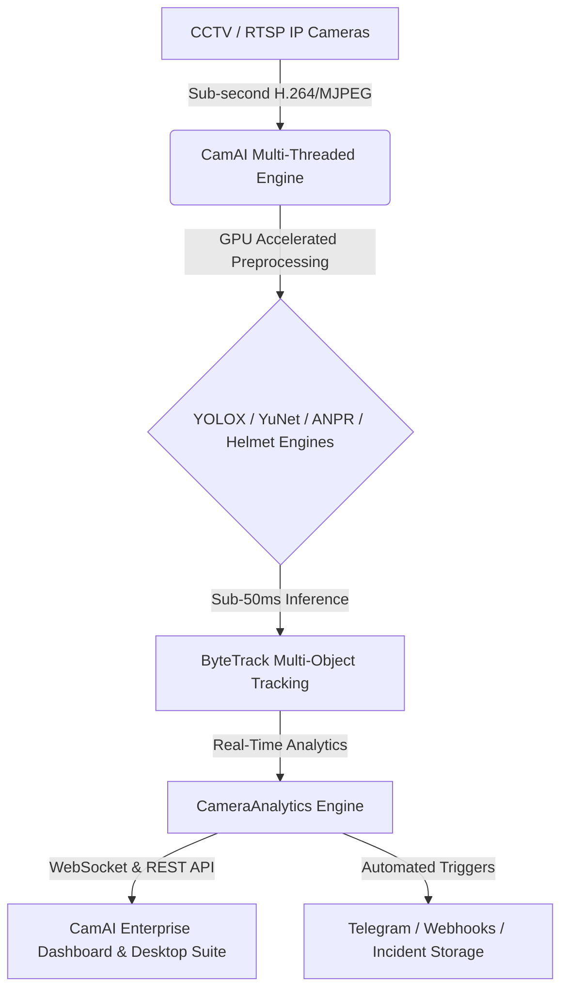

# CamAI Enterprise AI Vision & Video Analytics System
## Executive Summary & Solution Overview

---

> **Classification**: Confidential / Enterprise Due Diligence & Technical Handover  
> **Target Audience**: Enterprise Customers, CTOs, Investors, Acquisition Buyers, System Integrators  
> **System Version**: v1.0.0-Enterprise  
> **Document Reference**: `DOC-EXSUM-01`

---

## 1. Product Overview

**CamAI Enterprise** is a state-of-the-art, high-performance edge/cloud AI Vision & Real-Time Video Analytics Platform engineered for enterprise security, smart city management, industrial monitoring, traffic enforcement, and retail analytics.

Built upon a zero-copy, multi-threaded pipeline architecture with dynamic GPU hardware acceleration (supporting NVIDIA TensorRT, CUDA FP16, OpenVINO, DirectML, and PyTorch), CamAI Enterprise transforms raw RTSP/MJPEG IP camera streams into actionable, real-time structured telemetry, automated alerts, and forensic analytics.

---

## 2. Business Problem & Market Need

Modern organizations operate thousands of video surveillance cameras. However, standard surveillance infrastructure suffers from critical operational bottlenecks:

1. **Human Vigilance Fatigue**: Over 95% of security video feeds go unmonitored after 20 minutes of continuous human viewing.
2. **High Latency & Slow Incident Response**: Manual detection of security breaches, vehicle overspeeding, or unmonitored hazards occurs hours or days after the incident.
3. **High Cloud Infrastructure Costs**: Streaming raw high-definition video feeds to centralized cloud AI platforms incurs exorbitant bandwidth and cloud compute fees.
4. **Hardware Lock-in & Vendor Fragmentation**: Fragmented point solutions force enterprises to deploy separate boxes for ANPR, face recognition, and perimeter defense.

---

## 3. The CamAI Solution

CamAI Enterprise solves these challenges by combining an **Edge-First hybrid AI architecture** with **dynamic hardware governance**:

- **Edge & Local Processing**: Performs frame decoding, multi-model AI inference, object tracking, and rule evaluations directly on local edge hardware or on-premise GPU servers—slashing cloud bandwidth costs by over 99%.
- **Zero-Latency Monitoring**: Emits structured telemetry (bounding boxes, speed estimates, tracking trajectories, counts) over lightweight WebSockets in under 50ms.
- **Universal Hardware Compatibility**: Auto-detects available GPU acceleration—NVIDIA TensorRT/CUDA, Intel iGPU/dGPU via OpenVINO, or Windows DirectX 12 via DirectML—with seamless CPU fallback.
- **Unified Analytics**: Combines perimeter intrusion detection, automatic number plate recognition (ANPR), speed estimation, helmet detection, face detection, unattended item alerts, and crowd analytics into a single pane of glass. (Face **detection** only — CamAI does not perform biometric identity matching; see `LICENSING.md` §2a.)

---

## 4. Vision & Mission

* **Vision**: To provide the most efficient, resilient, and enterprise-ready vision intelligence platform that empowers smart cities, airports, manufacturing plants, and enterprises to achieve zero-latency automated situational awareness.
* **Mission**: To deliver high-performance, modular, and privacy-compliant AI video analytics software that maximizes existing CCTV hardware investments while reducing operational overhead.

---

## 5. Key Capabilities

| Capability | Technical Detail | Business Value |
| :--- | :--- | :--- |
| **Real-Time Detection & Tracking** | YOLOX-S / YOLO11 + ByteTrack Kalman filter tracking | Tracks up to 100+ concurrent targets per camera at 25-60 FPS |
| **Automatic Speed Estimation** | Height-based homography + 1D Kalman noise filtering | Provides live vehicle speed metrics without expensive radar hardware |
| **ANPR & Optical Character Recognition** | Automated plate localization + CRNN text recognition | Instant vehicle identification for toll gates and gated facilities |
| **Helmet & Safety Compliance** | Dual-pass vehicle crop + helmet classification model | Automated traffic enforcement and industrial workplace safety |
| **Perimeter & Line Crossing** | Polygon zones & directional threshold crossing gates | Instant intrusion alerts for restricted enterprise zones |
| **Unattended Object Detection** | Stationary item persistence timer & background tracking | Airport and station security monitoring for abandoned luggage |
| **Adaptive GPU Tile Governor** | Dynamic closed-loop resolution & tile allocation | Optimizes GPU/CPU load balance automatically across 1 to 64+ cameras |

---

## 6. Target Industries

1. **Smart Cities & Traffic Enforcement**: Speed limit monitoring, ANPR, helmet detection, traffic density & signal violation analysis.
2. **Airports & Transportation Hubs**: Abandoned luggage detection, perimeter breach prevention, crowd density control.
3. **Industrial & Manufacturing Facilities**: Workplace safety verification, restricted area entry detection, worker headcounts.
4. **Commercial Real Estate & Malls**: People counting, heatmap occupancy analysis, parking slot utilization.
5. **High-Security Enterprise Campuses**: Dual-authentication face detection, perimeter barrier monitoring, incident recording.

---

## 7. Competitive Advantages

1. **100% On-Premise / Edge Capability**: Operates fully offline without internet dependency or mandatory external cloud APIs.
2. **Sub-50ms Inference Latency**: Optimizations including zero-copy frame buffers, async queues, and FP16 kernel compilation deliver immediate feedback.
3. **Interleaved AI Tracking**: Automatically interleaves deep inference with lightweight ByteTrack prediction cycles to achieve smooth 30-60 FPS rendering while using less GPU compute.
4. **Zero-Lock-In Modular Architecture**: Standardized REST API, WebSockets, OpenVINO, and ONNX model formats allow drop-in custom fine-tuned weights.

---

## 8. Return on Investment (ROI) & Business Value

* **Operational Cost Reduction**: Automates video monitoring, reducing manual security guard labor requirements by up to **70%**.
* **Bandwidth Optimization**: Transmits only lightweight structured JSON telemetry and JPEG snapshots rather than continuous uncompressed video streams to central monitoring centers, saving **95%+ bandwidth**.
* **Hardware Cost Savings**: Runs on existing RTSP camera networks and standard commercial off-the-shelf GPU servers without proprietary hardware appliances.
* **Rapid Deployment**: Containerized Docker and standalone frozen executable builds allow enterprise-wide rollout in under **30 minutes**.
