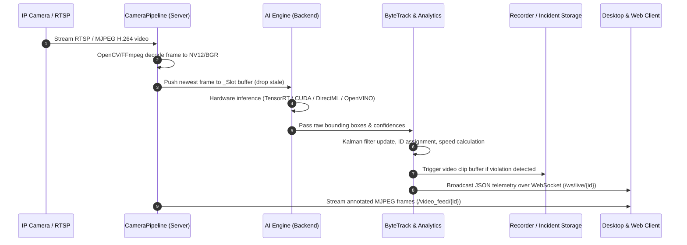

# CamAI Enterprise - Product Documentation & Workflow Manual

---

> **Classification**: Enterprise Technical & User Documentation  
> **Document Reference**: `DOC-PROD-02`

---

## 1. End-to-End System Workflow

CamAI Enterprise operates across three distinct operational layers: **Capture & Decoding**, **AI Analytics Processing**, and **Multi-Client Presentation**.

---

## 2. Multi-Grid Workspace & Real-Time Monitoring

### 2.1 Live Monitoring Grid
The **Workspace Screen** provides low-latency multi-camera grid playback supporting variable grid densities:
- **1x1 Grid**: Single-camera focus view with maximum resolution.
- **2x2 Grid**: 4 active streams for small facility monitoring.
- **3x3 Grid**: 9 active streams for commercial campus monitoring.
- **4x4 Grid**: 16 active streams for city surveillance centers.
- **Custom Density**: Up to 64 streams dynamically managed by the background tile governor.

### 2.2 Fullscreen Interactive Viewer (`FullscreenViewer.tsx`)
Clicking any camera tile expands the feed into an interactive, high-framerate overlay view featuring:
- **Zero-Stutter MJPEG Stream**: Resilient auto-reconnecting image pipeline.
- **Dynamic Bounding Box Overlay**: Renders track IDs, class labels, confidence scores, and live vehicle speed metrics (`km/h`).
- **Telemetry HUD**: Displays real-time pipeline FPS, camera hardware FPS, total processing latency, CPU/GPU utilization, and active object counters.
- **Interactive Controls**: Snapshot capture, local clip recording, mute/unmute audio, full screen toggle, and camera profile switcher.

---

## 3. Camera Management & Configuration

### 3.1 Camera Registration & Discovery
Admin users can register cameras via RTSP URL, HTTP MJPEG stream, or local video file for simulation.

* **Supported Input Protocols**:
  - `rtsp://[user]:[pass]@[ip]:[port]/[path]` (H.264 / H.265 via FFmpeg)
  - `http://[ip]:[port]/video` (MJPEG)
  - `file:///[path]` (MP4 / AVI test inputs)
- **Automatic Health Probe**: Evaluates connection latency, stream resolution, framerate, and codec before adding camera to active pipeline.

### 3.2 Zone & Line Profile Editor
The visual zone editor enables operators to draw vector geometries directly over live camera snapshots:
- **Detection Zones**: Multi-vertex polygons defining areas for intrusion monitoring, crowd density alerts, or vehicle entry/exit tracking.
- **Counting Lines**: Directional vectors (with `A -> B` and `B -> A` orientation arrows) to tally people or vehicles crossing thresholds.
- **Speed Calibration Gates**: Dual parallel reference lines with calibrated physical distance (in meters) for certified speed enforcement.

---

## 4. AI Engine & Rule Configuration

### 4.1 Zone Profiles
Camera analytics behavior is governed by pre-configured or custom zone profiles:

| Profile | Active Detectors | Suppressed Classes | Target Use Case |
| :--- | :--- | :--- | :--- |
| **Traffic Profile** | Vehicles, Speed, ANPR, Helmet, Stop Line, Traffic Light | Handbags, Backpacks | Highway monitoring, toll gates |
| **Security Profile** | People, Intrusion, Face, Unattended Items, Backpacks | Vehicles, Buses | Enterprise perimeters, lobbies |
| **Factory Profile** | Workers, Helmet, Zone Entry, People Count | Non-industrial items | Industrial plants, construction sites |
| **Custom Profile** | User-configured toggles | None | Custom enterprise installations |

### 4.2 Analytics & Feature Toggles
Operators can fine-tune individual analytics features per camera:
- `vehicle_detection`: Vehicle class filtering (`car`, `bus`, `truck`, `motorcycle`, `bicycle`).
- `person_detection`: Human presence detection & tracking.
- `speed_limit`: Enables vehicle speed estimation and overspeed violation alerting.
- `helmet_detection`: Runs secondary classification pass on motorcycle rider crops.
- `anpr`: Runs plate detection model and CRNN OCR on vehicle crops.
- `face_detection`: Executes YuNet facial detection on human crops.
- `object_left_behind`: Monitors stationary item persistence timer (>30 seconds).

---

## 5. Alerts & Incident Management

### 5.1 Real-Time Alert Engine
When a rule evaluation evaluates to positive (e.g. vehicle speed > speed limit, unhandled line crossing, missing helmet), the system:
1. Emits an instant alert event packet over the WebSocket telemetry stream.
2. Triggers the background **Recorder** module to capture a 10-second MP4 video clip around the incident timestamp (5s pre-event + 5s post-event).
3. Dispatches automated notifications via **Telegram Bot API** or custom Enterprise Webhooks with snapshot attachments.

### 5.2 Incident Log & Search
- Operators can filter incident logs by camera ID, alert type (`overspeed`, `intrusion`, `no_helmet`, `anpr`, `object_left_behind`), severity, or timestamp.
- Downloadable MP4 evidence clips and high-resolution JPEG snapshot images for forensic auditing.

---

## 6. User Roles & Access Control

CamAI Enterprise enforces strict Role-Based Access Control (RBAC):

| Role | Operational Scope | Permissions |
| :--- | :--- | :--- |
| **Admin** | Full Platform | Camera setup, user management, profile configuration, GPU tuning, system logs |
| **Operator** | Live Monitoring & Alerts | View grid streams, inspect alerts, download incident clips, control audio |
| **Viewer** | Read-Only Monitoring | View live grid streams without administrative or configuration rights |
