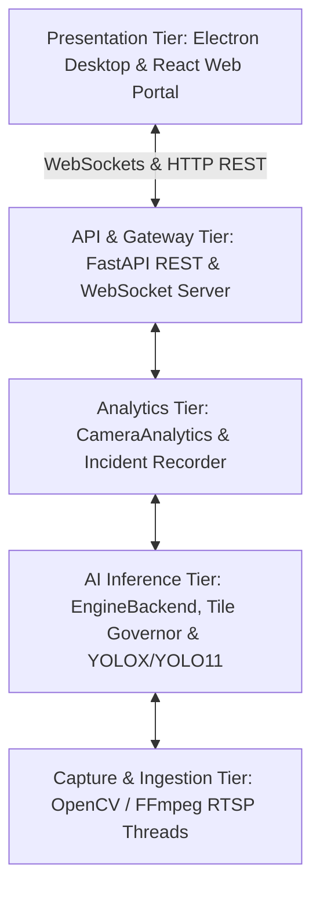
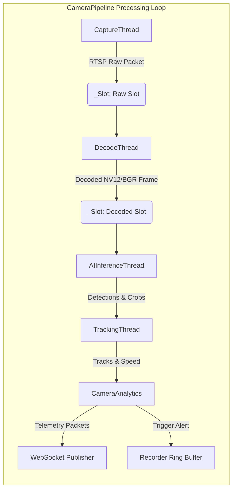
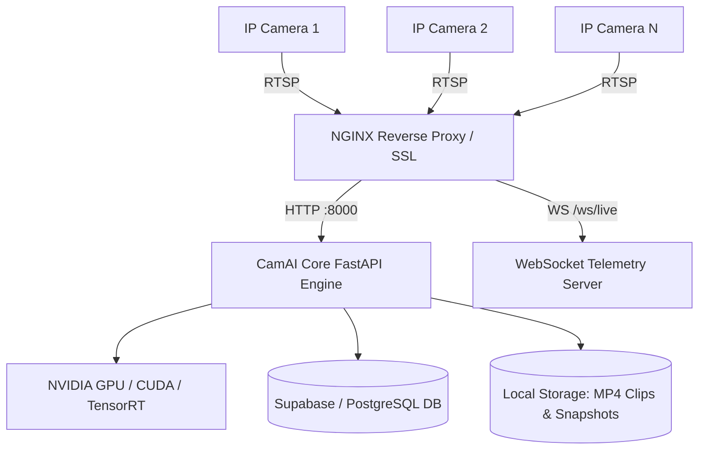

# CamAI Enterprise - Software Architecture & Technical Design Document

---

> **Classification**: Enterprise Software Architecture & Technical Specification  
> **Document Reference**: `DOC-ARCH-03`

---

## 1. High-Level System Architecture

CamAI Enterprise follows an **Edge-First, Event-Driven Decoupled Architecture**. System responsibilities are divided into five discrete tiers:

---

## 2. Detailed Component Architecture

### 2.1 Backend Core Components (`server/app/`)
1. `main.py`: FastAPI server entrypoint. Exposes REST API management routes and high-frequency WebSocket telemetry endpoints.
2. `camera_manager.py`: Process-wide manager managing lifecycle of active `CameraPipeline` worker threads.
3. `ai/pipeline.py`: Asynchronous 5-stage pipeline per camera (`CaptureThread` -> `DecodeThread` -> `AIInferenceThread` -> `TrackingThread` -> `Recorder/Streamer`).
4. `ai/backend.py`: Unified inference backend supporting TensorRT FP16, CUDA, OpenVINO GPU/CPU, DirectML, and PyTorch.
5. `ai/tile_governor.py`: Closed-loop GPU governor managing tile allocation, resolution scaling, and device headroom.
6. `analytics.py`: Rule evaluation engine (zones, lines, speed calculation, helmet gating, ANPR matching).
7. `recorder.py`: Non-blocking circular ring buffer recorder emitting MP4 video clips on alert triggers.
8. `gpu_monitor.py`: Daemon sampling thread providing sub-second GPU utilization, VRAM %, and temperature.

---

## 3. Data Flow & Thread Model

Each camera feed operates its own isolated `CameraPipeline` multi-threaded execution context to prevent a slow or failing stream from blocking others:

### Thread Safety & Lock Strategy
- **Zero Lock Contention on Frames**: Frame handover between stages uses atomic single-item `_Slot` objects that overwrite unconsumed stale frames, avoiding queue lock bloat and keeping system latency < 50ms.
- **Backend Thread Isolation**: OpenVINO uses per-thread dedicated `InferRequest` instances (`_ov_requests`) sharing compiled kernels to allow safe parallel multi-camera GPU inference.
- **GIL Minimization**: Preprocessing (letterbox, transpose, normalize) and postprocessing (NMS, box decoding) use vectorized NumPy C-extensions.

---

## 4. Deployment Topology & Network Architecture

### 4.1 On-Premise Single-Server Deployment

### 4.2 Network Protocols & Ports

| Protocol | Port | Direction | Usage |
| :--- | :--- | :--- | :--- |
| **RTSP** | 554 | Inbound | IP Camera Video Stream Feed |
| **HTTP** | 8000 / 80 | Inbound | REST API & Frontend Web Serving |
| **WebSocket** | 8000 / 443 | Bidirectional | Sub-50ms Telemetry Broadcast |
| **PostgreSQL** | 5432 | Outbound | Database Persistence |
