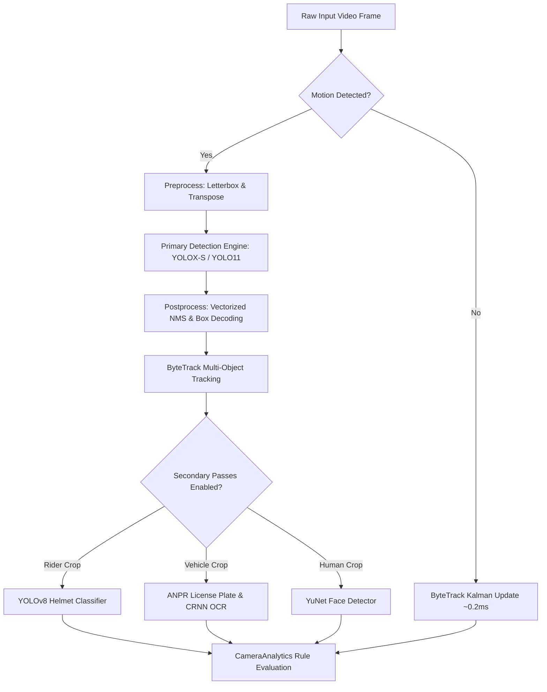

# CamAI Enterprise - AI Engine & Analytics Documentation

---

> **Classification**: Enterprise Deep Learning & Computer Vision Specification  
> **Document Reference**: `DOC-AI-05`

---

## 1. Deep Learning Pipeline Overview

The CamAI AI Engine is built around a multi-stage, modular computer vision pipeline optimized for real-time edge and server GPU execution:

---

## 2. Model Zoo & Specifications

| Model Phase | Network Architecture | Input Resolution | Execution Provider | Primary Classes / Tasks |
| :--- | :--- | :--- | :--- | :--- |
| **Primary Detection** | YOLOX-S / YOLO11-Nano | Dynamic (320x320 - 1280x1280) | TensorRT / CUDA FP16 / DirectML / OpenVINO | Person, Car, Bus, Truck, Motorcycle, Bicycle, Item, Infrastructure |
| **Face Detection** | YuNet Lightweight CNN | 320x320 | OpenVINO / ONNX | Human face localization & facial landmarks |
| **Helmet Detection** | YOLOv8-Nano Custom | 224x224 (Rider Crop) | OpenVINO / ONNX | `helmet`, `no_helmet` classification |
| **Plate Detection** | YOLOv8 Plate Detector | 416x416 (Vehicle Crop) | OpenVINO / ONNX | `number_plate` localization |
| **Plate OCR** | CRNN (CNN + GRU + CTC) | 128x32 (Plate Crop) | OpenVINO / ONNX | Alphanumeric character sequence recognition |

---

## 3. Real-Time Vehicle Speed Estimation Math

CamAI Enterprise estimates vehicle speed without requiring external radar hardware using a combination of camera geometry, physical object height reference constants (`CLASS_HEIGHT_M`), and 1D Kalman noise filtering:

### 3.1 Mathematical Derivation
1. **Vertical Bounding Box Scale**: For a detected vehicle of class $c$ (e.g. `car` height $\approx 1.5\text{ m}$, `bus` $\approx 3.2\text{ m}$) with bounding box pixel height $h_{\text{px}}$ in a frame of height $H$:
   $$\text{Distance } Z \approx \frac{f \cdot H_{\text{real}}}{h_{\text{px}}}$$
2. **Displacement Mapping**: The vehicle centroid displacement $\Delta y_{\text{px}}$ across consecutive frame time delta $\Delta t$ is mapped to ground-plane meters $\Delta Y_{\text{meters}}$.
3. **Velocity Computation**:
   $$v_{\text{raw}} = \frac{\Delta Y_{\text{meters}}}{\Delta t} \times 3.6 \quad [\text{km/h}]$$
4. **1D Kalman Filtering**: Raw velocity measurements $v_{\text{raw}}$ are passed through `_SpeedKalman1D` to smooth frame-to-frame bounding box jitter and eliminate false speed spikes:
   $$\hat{x}_k = \hat{x}_{k-1} + K_k (z_k - \hat{x}_{k-1})$$

---

## 4. Hardware Acceleration & Precision Tuning

### 4.1 FP16 Half-Precision Inference
- On NVIDIA GPUs (TensorRT & CUDA FP16), neural network weights and intermediate tensor activations run in IEEE 754 FP16 half-precision format. This cuts GPU memory bandwidth pressure by 50% and doubles tensor core execution speed without sacrificing detection accuracy.

### 4.2 Intel OpenVINO Optimizations
- **Compile Caching**: OpenVINO compiled model artifacts are cached to `%APPDATA%/CamAI/ov_cache` to accelerate subsequent process startup times from minutes to milliseconds.
- **Per-Thread `InferRequest` Pooling**: Each active camera pipeline thread holds a dedicated `InferRequest` object to allow lock-free concurrent multi-stream GPU execution.
