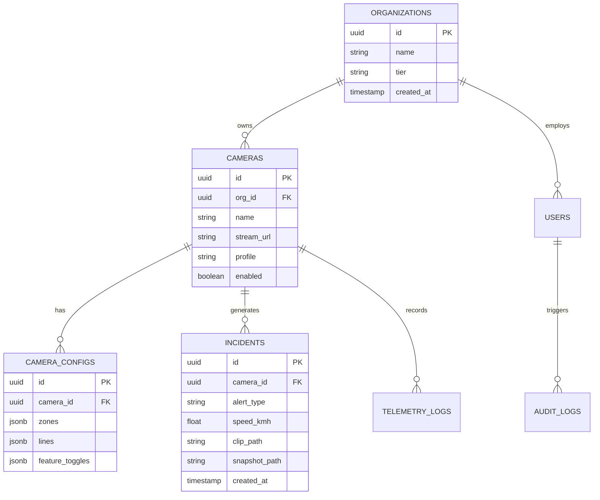

# CamAI Enterprise - Database Documentation & Schema Reference

---

> **Classification**: Enterprise Database Specification  
> **Document Reference**: `DOC-DB-07`  
> **Target Database Engine**: PostgreSQL 15+ / Supabase

---

## 1. Entity Relationship (ER) Diagram



---

## 2. Table Specifications

### 2.1 Table: `cameras`
Stores registered IP camera configurations.

| Column | Type | Constraints | Description |
| :--- | :--- | :--- | :--- |
| `id` | `UUID` | `PRIMARY KEY`, Default `gen_random_uuid()` | Unique camera identifier |
| `org_id` | `UUID` | `FOREIGN KEY (organizations.id)`, `NOT NULL` | Owning organization |
| `name` | `VARCHAR(255)` | `NOT NULL` | Human-readable camera label |
| `stream_url` | `TEXT` | `NOT NULL` | RTSP or HTTP MJPEG stream URL |
| `profile` | `VARCHAR(50)` | Default `'traffic'` | Active zone profile (`traffic`, `security`, `factory`) |
| `enabled` | `BOOLEAN` | Default `true` | Pipeline execution status |

---

### 2.2 Table: `incidents`
Stores security and traffic rule violation events.

| Column | Type | Constraints | Description |
| :--- | :--- | :--- | :--- |
| `id` | `UUID` | `PRIMARY KEY` | Incident unique ID |
| `camera_id` | `UUID` | `FOREIGN KEY (cameras.id) ON DELETE CASCADE` | Source camera |
| `alert_type` | `VARCHAR(100)` | `NOT NULL`, Indexed | Violation type (`overspeed`, `no_helmet`, `intrusion`) |
| `speed_kmh` | `NUMERIC(5, 2)` | Nullable | Recorded speed for traffic violations |
| `clip_path` | `TEXT` | Nullable | Relative path to recorded 10s MP4 evidence clip |
| `snapshot_path` | `TEXT` | Nullable | Relative path to high-res JPEG image |
| `created_at` | `TIMESTAMPTZ` | Default `NOW()`, Indexed | Event timestamp |

---

## 3. Indexes & Performance Optimization

```sql
-- Speed query execution on historical incident lookups
CREATE INDEX idx_incidents_camera_timestamp ON incidents (camera_id, created_at DESC);
CREATE INDEX idx_incidents_alert_type ON incidents (alert_type);

-- Row Level Security (RLS) Policy for Multi-Tenant Data Isolation
ALTER TABLE cameras ENABLE ROW LEVEL SECURITY;
CREATE POLICY camera_org_isolation ON cameras
    FOR ALL USING (org_id = auth.jwt() ->> 'org_id');
```
