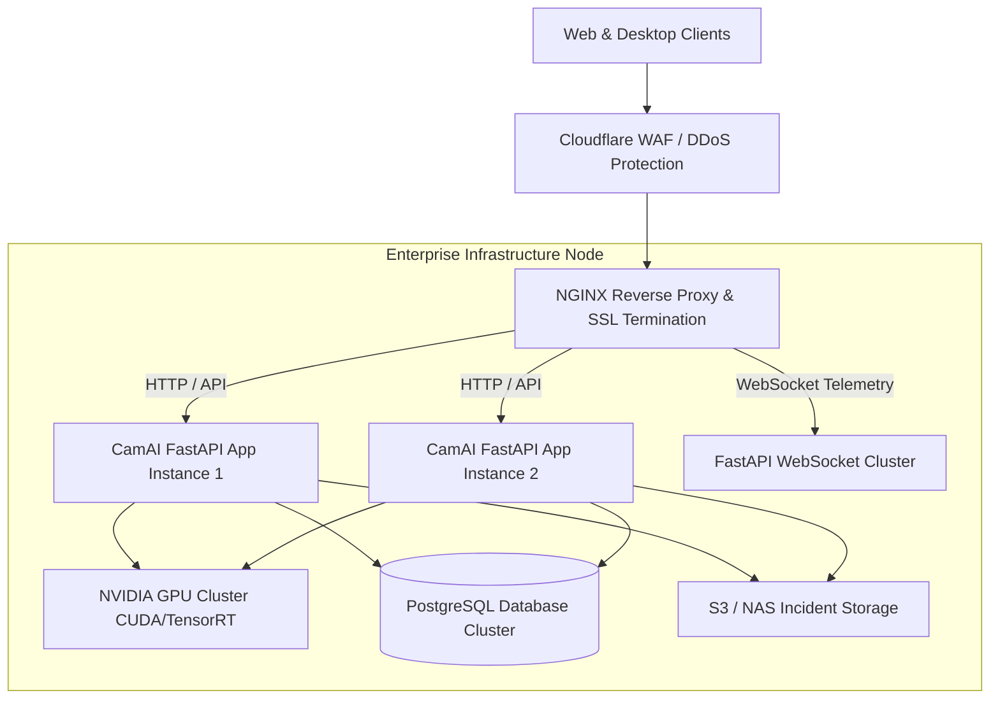

# CamAI Enterprise - DevOps & Enterprise Deployment Guide

---

> **Classification**: Enterprise Infrastructure & DevOps Manual  
> **Document Reference**: `DOC-DEVOPS-10`

---

## 1. Enterprise Deployment Topologies



---

## 2. Production NGINX Configuration (`nginx.conf`)

```nginx
server {
    listen 80;
    server_name camai.enterprise.com;
    return 301 https://$host$request_uri;
}

server {
    listen 443 ssl http2;
    server_name camai.enterprise.com;

    ssl_certificate /etc/letsencrypt/live/camai.enterprise.com/fullchain.pem;
    ssl_certificate_key /etc/letsencrypt/live/camai.enterprise.com/privkey.pem;

    # Web SaaS Portal Frontend
    location / {
        root /var/www/camai-client;
        try_files $uri /index.html;
    }

    # FastAPI REST Engine
    location /api/ {
        proxy_pass http://127.0.0.1:8000;
        proxy_set_header Host $host;
        proxy_set_header X-Real-IP $remote_addr;
    }

    # WebSocket Telemetry Channel
    location /ws/ {
        proxy_pass http://127.0.0.1:8000;
        proxy_http_version 1.1;
        proxy_set_header Upgrade $http_upgrade;
        proxy_set_header Connection "Upgrade";
        proxy_set_header Host $host;
        proxy_read_timeout 86400s;
    }
}
```
