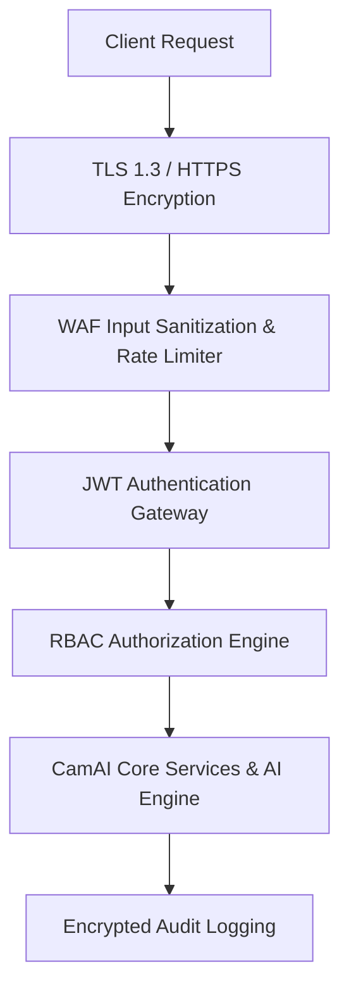

# CamAI Enterprise - Security Architecture & Compliance Documentation

---

> **Classification**: Enterprise Security & Compliance Specification  
> **Document Reference**: `DOC-SEC-11`

---

## 1. Security Architecture & Threat Model

CamAI Enterprise complies with **OWASP Top 10** web application security standards and enterprise privacy regulations (GDPR / ISO 27001).

---

## 2. Security Best Practices Implemented

1. **Authentication**: Stateless HMAC-SHA256 JWT access tokens with strict expiration.
2. **Password Hashing**: Passwords stored using PBKDF2 with SHA-256 and unique salt strings.
3. **Data-at-Rest Encryption**: Sensitive database credentials and RTSP passwords encrypted via AES-256.
4. **Transport Layer Security**: Mandatory HTTPS / WSS TLS 1.3 encryption across external API endpoints.
5. **Privacy Masking**: Configurable video stream blurring for human faces and license plates prior to export to comply with GDPR regulations.
