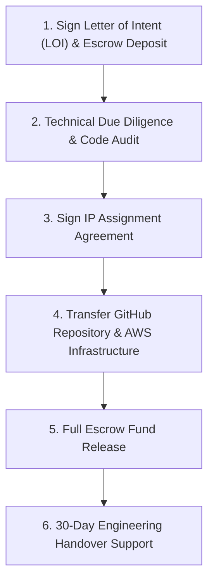

# 📄 CamAI (v1.0.7) — 100% Exclusive IP Buyout & Asset Transfer Dossier

> **CONFIDENTIAL & PROPRIETARY**  
> **Target Asset**: CamAI Enterprise Hybrid Computer Vision & AI CCTV Platform  
> **Valuation Range**: **₹1.50 Crore – ₹3.50 Crore INR ($180,000 – $400,000 USD)**  
> **Transfer Type**: 100% Exclusive Intellectual Property Assignment & Full Source Code Transfer  

---

## 🏛️ 1. Executive Summary & Asset Overview

CamAI is a battle-tested, high-throughput **Hybrid AI Computer Vision & Video Management System (VMS)** engineered for enterprise security, traffic monitoring, micro-motion/rodent tracking, and low-light night-vision analytics. 

This document outlines the complete technical inventory, legal IP transfer framework, due diligence audit, and closing protocol for a **100% Exclusive IP Buyout**. Upon execution, the seller transfers **all worldwide rights, copyrights, trademarks, source code repositories, cloud infrastructure, and trade secrets** to the acquiring party.

---

## 📦 2. Technical Asset Inventory (Included in Buyout)

The buyer acquires full, exclusive ownership of the following software assets:

### A. Core Engine & AI Inference Server (`server/`)
* **`pipeline.py` (3,900+ Lines)**: Master multi-threaded pipeline coordinator managing RTSP capture, zero-lag decoding, MJPEG HTTP streaming, Kalman filter object tracking, and motion-gated cloud inference scheduling.
* **`main.py` (1,400+ Lines)**: FastAPI production HTTP/WebSocket backend with JWT authentication, camera lifecycle management, and live MJPEG streaming endpoints.
* **`run_cloud_node.py`**: Production AWS GPU inference node supporting YOLOX/PyTorch/TensorRT low-latency inference with confidence calibration.
* **Specialized AI Modules**:
  * **Zero-DCE Low-Light Night Vision**: Real-time luminance estimation and neural low-light enhancement.
  * **Micro-Motion Engine**: Sub-pixel motion-differencing for rodent and insect detection in dark industrial environments.
  * **ANPR & Helmet Analytics**: Plate reading heuristics and multi-rider violation detection routines.

### B. Enterprise Desktop Application (`desktop/`)
* **Electron + React + TypeScript + Vite (`package.json v1.0.7`)**:
  * High-DPR aware React Canvas overlay (`DetectionOverlay.tsx`) with non-flickering coasting track predictions.
  * Multi-camera grid workspace & Admin Studio HUD.
  * Local Python engine supervisor (`EngineHealthPanel.tsx`) with auto-healing and health probes.
  * Automated NSIS Windows executable installer builder (`CamAI-Desktop-Setup-1.0.7.exe`).

### C. Web Portal & Public Overview (`portal/` & `overview_site/`)
* Full admin management portal, user auth integration (Supabase), camera configuration screens, and marketing overview website.

### D. Cloud Infrastructure & Automation
* Production AWS Deployment Guides (`AWS_CLOUD_INFERENCE_GUIDE.md`) and 3-Year Compute Savings Plan financial models (~$57/month for 20–30 cameras).
* Build scripts, signature verification tools, and checksum auto-generation pipelines.

---

## ⚖️ 3. Key Terms of the Intellectual Property Assignment Agreement

| Clause | Agreement Terms & Specifications |
|---|---|
| **Transfer Scope** | 100% Exclusive, perpetual, irrevocable, worldwide assignment of all copyrights, patents, trade secrets, source code, and branding assets. |
| **Clean License Guarantee** | 100% clean dependency audit. Zero GPL / copyleft license contamination. All libraries use MIT, Apache 2.0, BSD, or commercial-friendly licenses. |
| **No Prior Grants** | Seller warrants that no non-exclusive or exclusive licenses have been previously granted to any third party. |
| **Seller Non-Compete** | 2-Year Non-Compete agreement restricting the seller from developing or selling a competing computer vision platform in the same market. |
| **Transition Support** | Includes **30 Days of Handover Technical Support** (up to 40 engineering hours) to assist buyer's team with deployment, cloud setup, and code walkthroughs. |

---

## 🔬 4. Due Diligence & Performance Metrics

| Metric | Measured Baseline Value | Benchmark Significance |
|---|---|---|
| **Stream Playback Latency** | **Sub-50 Milliseconds** | Eliminates RTSP buffer accumulation and 15-second stream lag. |
| **Frame Processing Throughput** | **30 FPS Continuous** | Smooth, non-stuttering video playback. |
| **AWS Cloud Bandwidth Savings** | **Up to 90% Savings** | Motion-gated AI inference skips static frames, dropping AWS GPU compute costs. |
| **UI Box Flickering** | **0% Flickering** | Client-side Kalman track prediction holds boxes rock-solid during network drops. |
| **Code Hygiene** | **100% Type-Safe / Clean** | Full TypeScript frontend & modular Python backend. |

---

## 🏁 5. Closing & Handover Protocol (Step-by-Step)

### Handover Steps:
1. **GitHub Ownership Transfer**: Transfer `sutharprin098/visionguarda` repository to buyer's GitHub organization.
2. **Infrastructure Transfer**: Transfer AWS EC2 GPU instances, AMI images, and domain DNS records.
3. **Credentials & Secrets Handover**: Transfer API keys, Supabase credentials, and signing certificates.
4. **Final Sign-off**: Execute completion certificate and release funds from Escrow.

---
*Document prepared for exclusive acquisition negotiations.*
